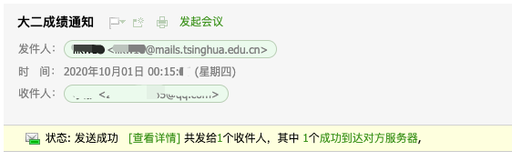

# Tutor Helper

用于辅导员相关工作的自动化

# Structure

* gpa: 用于GPA计算和成绩发送，目前成绩发送功能仅支持SMTP SSL。

其他功能后续按需添加。

# Requirements

- Python 3.7+
   - pandas >= 0.25.3
   - openpyxl >= 2.4.4
   - xlrd >= 1.1.0
   - smtplib  # Python自带，Python 3.6的smtplib发送邮件时，邮件地址前的备注名如果是中文，可能会乱码，3.7没问题

# Usage

**目前暂无打包成可执行程序的计划，后面有时间再搞吧^_^。**

## Installation

下载后，直接使用`python setup.py install`即可安装该`package`，后面的
操作，可以将`grade_ranker.py`和`grade_sender.py`复制到你需要的地方按照
下面的方式使用。

## Brief

1. 适当修改复制后的`grade_ranker.py`，使用`Python`运行即可。
2. 适当修改复制后的`grade_sender.py`，使用`Python`运行即可。

## Details

### Calculate the ranks

#### Download the data

在`grade_ranker.py`中，`path`定义了原始成绩对应的文件（需要进行简单的前处理，
具体见下）或文件夹的路径，如果是文件夹，则本脚本将会读取文件夹中所有的表格文件，
并将文件中的所有同学的成绩合并。

>注意：目前脚本中没有对重复的课程记录进行处理，因此如果重复，则可能计算结果错误，
>不过一般情况下导儿们应该也不会这么干的吧？或许后续的版本会进行检测和去重。

>个人建议：可以直接从`info`下载全部成绩，然后通过班级筛选，把筛选后的所有数据复制到新的Excel
>表格之中，这样就一个表格就够了，而且也不会出现重复。但如果涉及的成绩数据过多，`info`的
>下载上限可能会起作用，此时可以分班级下载，并放在同一个文件夹中。

在从`info`系统导出的时候，需要选中的选项如下图（想要省事不用对照的话，可以直接点`全选`了）

图上框上的是系统默认没有选中的选项，注意第二张图中有两个`特殊选课标记`，这充分体现了`info`系统
的辣鸡（误）。由于这两个选项不好区分，所以建议都选上，然后可以使用预处理功能去掉多余的那一列。

提醒大家，`info`系统导出的还是`xls`格式的文件，建议使用预处理功能，如果有自行处理的需求，则请
关注下面讲到的预处理功能的具体内容：

- 把`xls`格式文件中的两列`特殊选课标记`删掉一列，保留全满的那一列
- 另存为`xlsx`文件

因此，使用者需要做的是：

1. 去`info`系统下载成绩，选项可以全选或者按照上面图中的选
2. 人工预处理或者程序预处理
   - 人工预处理：把下载下来的`xls`格式文件中的两列`特殊选课标记`删掉一列，保留全满的那一列，
   筛选需要做排序的同学，另存为`xlsx`文件
   - 程序预处理：参考`grade_ranker.py`，直接改开头的`path`即可
3. 如果是多个文件，放到单独的文件夹中；如果是单独一个文件，则放在合适的位置即可。

#### Modify the script

修改`grade_ranker.py`中`path`的值，如果是多个`xlsx`文件，需要放在同一个文件夹下，并将文件夹
路径赋给`path`。修改`output_path`为你想要的输出文件名（以xlsx结尾）。

修改`grade_ranker.py`中的`queries`，其中的每个`Query`会产生三列，分别为GPA、年级排名和班级排名。
`Query`的第一个参数为该成绩或排名的前缀，以`大二学年必修限选学分绩`为例，这三列的命名将是`大二学年必修限选学分绩`
`大二学年必修限选学分绩排名` `大二学年必修限选学分绩班级排名`。

`Query`的`Options`共有四个选项，其含义和类型如下：

- `course_classes`: 课程类型数组，包括`必修` `限选` `任选`，如果为空，则任意类型课程均计入。
- `semesters`：学期数组，格式如`2018-2019-3`，其中`3`表示夏季小学期。
- `only_latest`: 如果有挂科和重修，是否只计入最后一次上该课程的成绩和学分，而不是多次计入，
一般只计入最后一次的，即采用默认值`True`。特殊情况下可以使用`False`。
- `only_primary`: 是否只计算第一学位课程，`True`为只统计第一学位课程，`False`为统计第一学位、
第二学位、辅修课程，一般只统计第一学位课程，即默认值`True`。

当有多个`Query`时，计算结果将都放入到同一个`Excel`表格中，如图所示：

图中具体数据已经被遮掉，各个班级的数据分别放置在不通的sheet中。注意，各列的宽度是手动调整之后的，后续或许会
处理一下。

### Send the notifications

生成成绩之后，还需要发给各位同学，这里提供的方案是使用`SMTP`进行邮件发送，代码中使用的是
`SMTP SSL`，在`grade_sender.py`中，需要设置一系列参数：

数据相关的参数：
- `rank_file`: 排名文件的路径，需要使用前面`grade_ranker.py`生成的`Excel`文件，或者参考其格式书写的`Excel`文件。
- `class_name`: 班级名称，本脚本一次仅发送一个班的成绩，有需要的导可以自行修改代码或者多次使用。
- `contact_file`: 邮件地址列表文件的路径，这里支持的是从清华邮箱中导出的`csv`格式的文件，实际上只用了`姓名`、`电子邮件地址`两个字段，
如果这个文件中有特殊字符可能会出错挂掉，所以建议导出之后删除掉其他所有的列。如果是从其他地方导出的通讯录，可以修改为仅包含`姓名`、`电子邮件地址`两个字段
的`csv`格式文件。
- `grade_number`: 全年级人数，即排名用的总人数，在`grade_ranker.py`计算后会输出。

`SMTP`相关的参数，这里以清华大学学生邮箱为例，使用其他邮箱则自行参考对应邮箱的相关文档：
- `server`: `SMTP Server`地址，清华学生邮箱为`mails.tsinghua.edu.cn`
- `port`: `SMTP port`，清华学生邮箱的`SMTP SSL`端口为`465`
- `user`: `SMTP`的账号，一般为邮箱地址，对于清华学生邮件系统来说就是邮箱地址
- `password`: `SMTP`的密码， 对于清华学生邮件系统来说就是邮箱密码，**一定不要把密码上传到GitHub等公开的地方**

邮件内容模板：
- `template`: 可以自定义邮件内容模板，如果为`None`，则使用`gpa/notifications/email/template.py`中的`basic_template`
作为模板。其中尖括号包裹的信息会对应的修改为相应的内容，具体对应关系可以对照该变量内容和下面的邮件内容示例。

其他参数：
- `display_name`: 在邮件中显示的发件人姓名，当smtplib版本较低时，这里的中文字符可能引起邮件乱码，建议使用英文，当
使用中文时，建议`python`版本为3.8+。
- `sender_name`: 在邮件正文中的落款，可以使用中文。

另外，`grade_sender.py`中的`subject`也可以按需修改，这将作为邮件的主题。

邮件将发送所有的字段，如下图：

为以防万一，可以将`grade_sender.py`中的`dry_run`置为`True`，此时邮件会只发第一封，且发送到发件人的邮箱。

注意：
- Python3部分版本对发件人和收件人姓名中带有中文或其他字符的支持有问题，会导致正文乱码，目前测试来看3.7.3有问题，3.7.16没问题

# Known Issues or Unimplemented Features

成绩排名部分：
1. 未打包成可执行程序方便使用
2. 多输入文件情形下，重复数据未进行处理
3. 对`xls`和`xlsx`文件的支持不全
4. 替代课程未进行处理（似乎也不用处理？）
5. 输出的表格未进行格式调整
6. 希望未来把数据存到数据库中

成绩发送部分：
1. 排名总人数未进行自动化计算
2. 邮件模板尚未使用专门的`template`相关的`package`
3. 邮件中的表格还可以优化，使用的库也可以调整
4. 邮件的`plain text`类型实际上没有进行合理地处理

测试：
1. 目前并没有进行比较完整的测试，不过根据自身使用实践，默认参数的计算和邮件发送都没有问题，
有兴趣的`Contributors`可以做一做？
2. 需要补充测试代码

其他问题可以开issue提。

# Acknowledgements

1. 感谢李天奇辅导员之前做的相关工作提供的启发，以及https://github.com/huangyf15/GPAsorter-THU 的启发。
注：这里的启发主要在于一些选项的设置，代码方面并没有进行参考。
2. 感谢http://www.decalage.info/python/html 提供的`HTML Table`相关的`package`。
